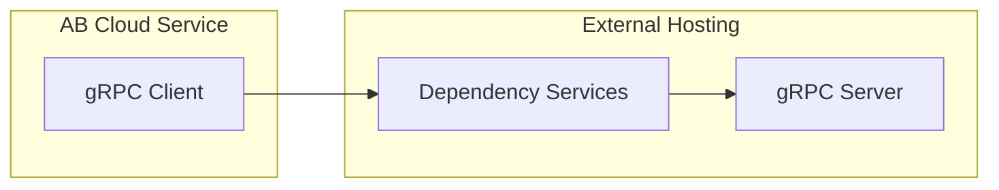

# AccelByte Cloud Service Customization gRPC Plugin Architecture

## Overview

AccelByte Cloud Service Customization gRPC Plugin Architecture consists of three (3) components.

- `gRPC server`
- `gRPC client`
- `dependency services`

### gRPC Server

A **stateless** gRPC server containing custom logic implemented by customer according to the provided *.proto file by AccelByte. The *.proto file used depends on the AccelByte Cloud service feature being customized. 

Sample projects for this in C#, Go, Java, and Python are available. Customers can pick one or more language to implement this.

See the following repositories.

- `plugin-arch-grpc-server-csharp`
- `plugin-arch-grpc-server-go`
- `plugin-arch-grpc-server-java`
- `plugin-arch-grpc-server-python`

### gRPC Client

The corresponding gRPC client to call gRPC server created by customers. It is to be implemented in AccelByte Cloud service for each feature which can be customized.  

Sample projects for this in Go and Java are available. It is implemented as a simple HTTP service which can call `gRPC server` functions. It should be possible for a gRPC client in one language to communicate with gRPC server in a different language.

See the following repositories.

- `plugin-arch-grpc-client-go`
- `plugin-arch-grpc-client-java`

### Dependency Services

Dependency services required by `gRPC server` and `gRPC client` for **security**, **reliability**, **scalability**, and **observability** in real environment. The docker-compose for this to facilitate local development and testing is available.

See `plugin-arch-grpc-dependencies` repository.

## How to Run The Sample Projects

1. Run `dependency services` for local development and testing.

   a. Clone `plugin-arch-grpc-dependencies` repository. 

   b. Follow the `README.md` inside to setup, build, and run it. 

   c. Keep it running.

2. Run a `gRPC server`, for example `plugin-arch-grpc-server-java`

   a. Clone `plugin-arch-grpc-server-java` repository. 

   b. Follow the `README.md` inside to setup, build, and run it. 
   
   c. Keep it running.

3. Run `gRPC client`, for example `plugin-arch-grpc-client-java`

   a. Clone `plugin-arch-grpc-client-java` repository. 

   b. Follow the `README.md` inside to setup, build, and run it.

   c. Try it out! See the instruction in `README.md`.

