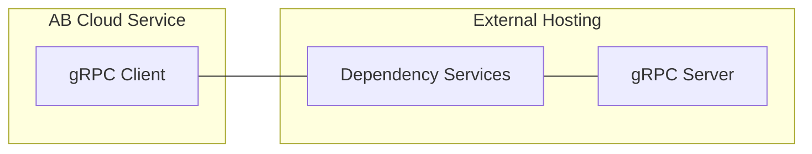

# AccelByte Cloud Service Customization gRPC Plugin Architecture

## Overview

AccelByte Cloud Service Customization gRPC Plugin Architecture consists of three (3) components.

- `gRPC server`
- `gRPC client`
- `dependency services`

### gRPC Server

A **stateless** `gRPC server` containing custom logic implemented by customer according to the provided *.proto file by AccelByte. The *.proto file used depends on the AccelByte Cloud service feature being customized. 

Sample projects for this in multiple programming languages are available. Customers can pick one or more language to implement this.

See the following repositories.

- For matchmaking custom function:

   - `matchmaking-function-grpc-plugin-server-csharp`
   - `matchmaking-function-grpc-plugin-server-go`
   - `matchmaking-function-grpc-plugin-server-java`
   - `matchmaking-function-grpc-plugin-server-python`

- For chat filter custom function:

   - `chat-filter-grpc-plugin-server-go`

There will be more `gRPC server` sample projects in the future as AccelByte Cloud service customization is expanded.

### gRPC Client

The corresponding `gRPC client` to call `gRPC server` created by customers. It is implemented in AccelByte Cloud service for each feature which can be customized. This sample `gRPC client` app project is provided to customers to help with local development and testing purposes only. 

Sample projects for this in multiple programming languages are available. It is possible for a `gRPC client` in one language to communicate with `gRPC server` in a different language.

See the following repositories.

- For matchmaking custom function:

   - `matchmaking-function-grpc-plugin-client-go`
   - `matchmaking-function-grpc-plugin-client-java`

- For chat filter custom function:

   - `chat-filter-grpc-plugin-client-go`

There will be more `gRPC client` sample projects in the future as AccelByte Cloud service customization is expanded.

### Dependency Services

While the `gRPC server` and the `gRPC client` are able communicate directly, additional services are necessary to provide **security**, **reliability**, **scalability**, and **observability**. These dependency services are packaged as a docker compose file.

See `grpc-plugin-dependencies` repository.

> :warning: **It is important to note:** the dependency services docker compose is provided as an example for local development environment only.
