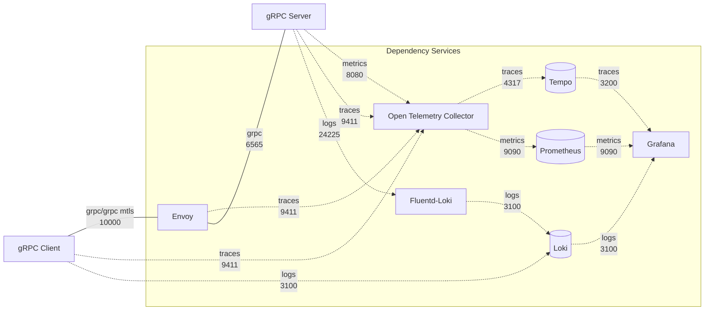

# grpc-plugin-dependencies



The `gRPC server` and the `gRPC client` can actually communicate directly. However, additional services are necessary to provide **security**, **reliability**, **scalability**, and **observability**. In this architecture, we call those services as `dependency services`.

This repository contains the docker compose of the `dependency services`. It consists of the following services.

- envoy
- grafana
- tempo
- loki
- prometeus
- opentelemetry-collector
- fluentd-loki

> :warning: **It is important to note:** the dependency services docker compose is provided as an example for local development environment only.

## Prerequisites

Windows 11 WSL2 or Linux Ubuntu 22.04 or macOS 14+ with the following tools installed:

a. Bash

    - On Windows WSL2 or Linux Ubuntu:

        ```
        bash --version

        GNU bash, version 5.1.16(1)-release (x86_64-pc-linux-gnu)
        ...
        ```

    - On macOS:

        ```
        bash --version

        GNU bash, version 3.2.57(1)-release (arm64-apple-darwin23)
        ...
        ```

b. Make

    - On Windows WSL2 or Linux Ubuntu:

        To install from the Ubuntu repository, run `sudo apt update && sudo apt install make`.

        ```
        make --version

        GNU Make 4.3
        ...
        ```

    - On macOS:

        ```
        make --version

        GNU Make 3.81
        ...
        ```

c. Docker (Docker Desktop 4.30+/Docker Engine v23.0+)

    - On Linux Ubuntu:

        1. To install from the Ubuntu repository, run `sudo apt update && sudo apt install docker.io docker-buildx docker-compose-v2`.
        2. Add your user to the `docker` group: `sudo usermod -aG docker $USER`.
        3. Log out and log back in to allow the changes to take effect.

    - On Windows or macOS:

        Follow Docker's documentation on installing the Docker Desktop on [Windows](https://docs.docker.com/desktop/install/windows-install/) or [macOS](https://docs.docker.com/desktop/install/mac-install/).

        ```
        docker version

        ...
        Server: Docker Desktop
        Engine:
        Version:          24.0.5
        ...
        ```

d. [ngrok](https://ngrok.com/)

    - Follow [ngrok's installation guide](https://ngrok.com/downloads).

## Setup

Create a docker compose `.env` file based on `.env.template` file. Modify any environment variables in the `.env` file if necessary.

## Running

To run the services, run the following command.

```
docker-compose up
```

## Administration and Observability

1. `Grafana` can be accessed at http://localhost:3000 to view the metrics, traces, and logs emitted. Some sample dashboards are included.

2. `Envoy` admin interface can be accessed at http://localhost:9901.

## Exposing Local gRPC Server to AccelByte Gaming Services

To test `gRPC server` running in local development environment with AccelByte Gaming Services, it needs to be exposed to the internet.
In order to do this without requiring a public IP address, we can use something like [ngrok](https://ngrok.com/).

1. Sign-in/sign-up to [ngrok](https://ngrok.com/) and get your auth token in `ngrok` dashboard.

2. Run the following command to expose `gRPC server` Envoy proxy port in local development environment to the internet.

   ```
   make ngrok NGROK_AUTHTOKEN=xxxxxxxxxxx
   ```
