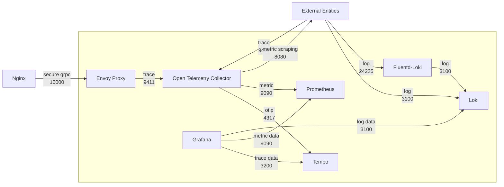

# plugin-arch-grpc-dependencies

> :warning: **If you are new to AccelByte Cloud Service Customization gRPC Plugin Architecture**: Start reading from [OVERVIEW.md](OVERVIEW.md) to get the full context.

Dependency services required by `gRPC server` and `gRPC client` for **reliability**, **scalability**, and **observability**. This repository contains docker compose to facilitate local development and testing.

- nginx
- envoy
- grafana
- tempo
- loki
- prometeus
- opentelemetry-collector
- fluentd-loki



## Prerequisites

- docker
- docker compose

## Setup

1. Create a docker compose `.env` file based on `.env.template` file. 
2. Fill in the required environment variables in `.env` file.
3. Put `server_cert.key` and `client_cert.key` file in `compose-config/certs` folder.

## Running

To start the services, run the following command.

```
docker-compose up
```

## Running with Ngrok

1. Sign-in/Sign-up to [ngrok](https://ngrok.com/). Get your auth token in ngrok Dashboard.
2. Open `.env` file and  set `NGROK_AUTHTOKEN` with your ngrok auth token.
3. You can set `NGROK_TARGET_PORT` to 10000 to use envoy mTLS.
4. Start the services with following command.
```
docker-compose -f docker-compose-ngrok.yaml up
```