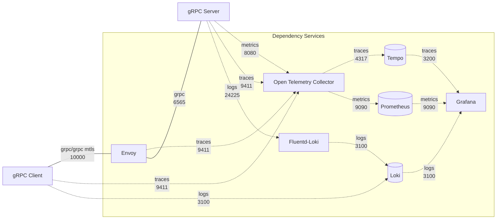

# grpc-plugin-dependencies



The `gRPC server` and the `gRPC client` can actually communicate directly. However, additional services are necessary to provide **security**, **reliability**, **scalability**, and **observability**. In this architecture, we call those services as `dependency services`.

This repository contains the docker compose of the `dependency services`. It consists of the following services.

- envoy
- grafana
- tempo
- loki
- prometeus
- opentelemetry-collector
- fluentd-loki

> :warning: **It is important to note:** the dependency services docker compose is provided as an example for local development environment only.

## Prerequisites

- docker v23.x
- docker compose v2.x

## Setup

Create a docker compose `.env` file based on `.env.template` file. Modify any environment variables in the `.env` file if necessary.

## Running

To run the services, run the following command.

```
docker-compose up
```

## Administration and Observability

1. `Grafana` can be accessed at http://localhost:3000 to view the metrics, traces, and logs emitted. Some sample dashboards are included.

2. `Envoy` admin interface can be accessed at http://localhost:9901.
