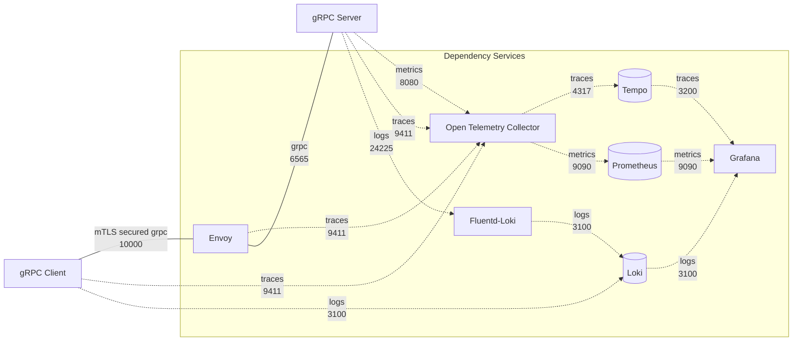

# plugin-arch-grpc-dependencies

> :warning: **If you are new to AccelByte Cloud Service Customization gRPC Plugin Architecture**: Start reading from [OVERVIEW.md](OVERVIEW.md) to get the full context.



The `gRPC server` and the `gRPC client` can actually communicate directly. However, additional services are necessary to provide **security**, **reliability**, **scalability**, and **observability**. In this architecture, we call those services as `dependency services`.

This repository contains the docker compose of the `dependency services`. It consists of the following services.

- envoy
- grafana
- tempo
- loki
- prometeus
- opentelemetry-collector
- fluentd-loki

> :warning: **It is important to note:** the dependency services docker compose is provided as an example for local development environment only.

## Prerequisites

- docker
- docker compose

## Setup

1. Run the following command to generate self-signed certificates required for mTLS secured gRPC for local development environment only.

   ```
   make certificate
   ```

   You can find the generated root CA, key, and certificate files for both `gRPC server` and `gRPC client` in `certs` folder.

2. Create a docker compose `.env` file based on `.env.template` file and modify any environment variables in `.env` file if necessary.

## Running

To start the services, run the following command.

```
docker-compose up
```

## Accessing Grafana

Grafana can be accessed at http://localhost:3000.

## Testing with AccelByte Cloud

To allow `gRPC client` in AccelByte Cloud to access `gRPC server` in local development environment without requiring a public IP address, we can use [ngrok](https://ngrok.com/).

1. Sign-in/sign-up to [ngrok](https://ngrok.com/) and get your auth token in `ngrok` dashboard.

2. Run the following command to expose `gRPC server` Envoy proxy port in local development environment to the internet.

   ```
   make ngrok NGROK_AUTHTOKEN=xxxxxxxxxxx
   ```
